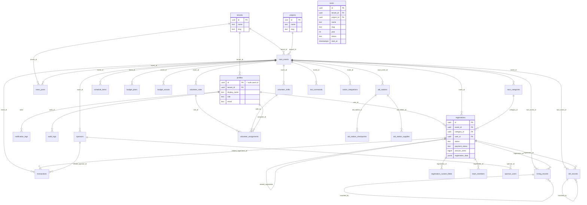

# RaceOne 資料庫設計與關連圖 (ERD)

> **版本**: 1.0 | **日期**: 2026-08-07
> **對應**: 28 張表 / 19 支 SQL migration (`supabase/migrations/`) / PostgreSQL

---

## 1. Mermaid ERD 圖

---

## 2. 資料表總覽 (28 張)

### 2.1 租戶 / 身份
| 表 | 用途 | 關鍵欄位 | RLS 角色 |
|:---|:-----|:--------|:--------|
| `tenants` | 租戶 / 組織 | id, name, slug | super_admin |
| `projects` | 白牌專案 | id, name, slug | super_admin |
| `profiles` | 使用者設定檔 | id(=auth.users), tenant_id, role, email | 自己 + admin |
| `auth.users` | (Supabase 內建) 認證帳號 | id, email, password | — |
| `audit_logs` | 審計日誌 | actor_id, action, target | **super_admin** |

### 2.2 賽事核心
| 表 | 用途 | 關連 | RLS 角色 |
|:---|:-----|:-----|:--------|
| `race_events` | 賽事活動 | tenant_id, project_id | 所有角色 |
| `race_categories` | 賽事組別 | event_id | 所有角色 |
| `registrations` | 報名記錄 | event_id, category_id, user_id | 自己 + admin |
| `registration_custom_fields` | 報名自訂欄位值 | registration_id | admin |
| `team_members` | 團體報名隊員 | registration_id | admin |

### 2.3 財務
| 表 | 用途 | 關連 | RLS 角色 |
|:---|:-----|:-----|:--------|
| `transactions` | 收支交易 | event_id, related_registration_id, related_sponsor_id | **super_admin, finance** |
| `budget_plans` | 預算規劃 | event_id | **super_admin, finance** |
| `budget_actuals` | 預算實際數據 | event_id | **super_admin, finance** |

### 2.4 贊助商 / 內容 / 行程
| 表 | 用途 | 關連 | RLS 角色 |
|:---|:-----|:-----|:--------|
| `sponsors` | 贊助商 | event_id | sponsor 角色 |
| `sponsor_users` | 贊助商帳號 | sponsor_id | sponsor |
| `news_posts` | 公告文章 | event_id, tenant_id | 公開 + editor |
| `schedule_items` | 行程任務 | event_id | 排程角色 |

### 2.5 賽日營運
| 表 | 用途 | 關連 | RLS 角色 |
|:---|:-----|:-----|:--------|
| `aid_stations` | 補給站 | race_event_id | volunteer |
| `aid_station_checkpoints` | 檢查點 | aid_station_id | volunteer |
| `aid_station_supplies` | 物資 | aid_station_id | volunteer |
| `timing_records` | 計時記錄 | race_event_id, registration_id | volunteer |
| `dnf_records` | DNF/DNS | race_event_id, registration_id | volunteer |

### 2.6 志工 / Bot / 通知 / Notion
| 表 | 用途 | 關連 | RLS 角色 |
|:---|:-----|:-----|:--------|
| `volunteer_roles` | 志工角色 | event_id | super_admin, volunteer_lead |
| `volunteer_shifts` | 志工排班 | event_id | super_admin, volunteer_lead |
| `volunteer_assignments` | 志工指派 | role_id, shift_id, assignee_id | super_admin, volunteer_lead |
| `bot_commands` | Bot 自訂指令 | event_id | **super_admin, finance** |
| `notification_logs` | 通知日誌 | (actor) | 自己 + admin |
| `notion_integrations` | Notion 設定 | event_id | **super_admin, finance** |
| `notion_sync_logs` | 同步日誌 | event_id | **super_admin, finance** |

---

## 3. ENUM 型別
- `user_role`: super_admin, manager, finance, content_editor, volunteer_lead, sponsor_manager, viewer
- `registration_status`: pending, confirmed, cancelled, waitlist, completed
- `transaction_type`: income, expense
- `transaction_category`: registration_fee, sponsorship, merchandise, ...
- `sponsor_tier`, `schedule_status`, `news_status`, `bot_platform`

---

## 4. FK 約束關鍵原則
- **計時/賽日表** (`timing_records` / `dnf_records` / `aid_stations`) 用 `race_event_id` 連 `race_events`
- **核心業務表** (`registrations` / `transactions` / `race_categories`) 用 `event_id`
- **多租戶隔離鍵**: tenants→`tenant_id`;賽事層→`event_id`;賽日層→`race_event_id`
- **軟刪除 / 審計**: audit_logs 記錄所有管理操作
- **觸發器**: `handle_new_user()` 在 auth 建立帳號時自動建立 profiles

---

*完整 migration SQL 見 `supabase/migrations/`(19 支,依序執行)。*
